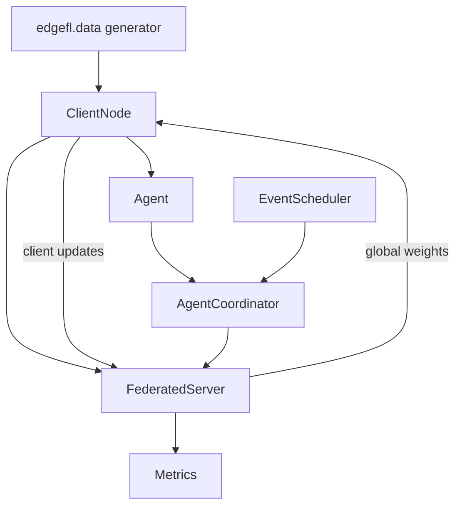

# Architecture

EdgeFL is organized as a small, composable stack:

1. **Data generation / loading** (`edgefl.data`)
2. **Local training nodes** (`edgefl.nodes`)
3. **Global aggregation server** (`edgefl.server`)
4. **Optional MAS coordination** (`edgefl.agents`, `edgefl.environment`)
5. **Experiment helpers** (`edgefl.simulation`, `edgefl.metrics`, `edgefl.utils`)

## Package overview

| Package | Purpose |
| --- | --- |
| `edgefl.data` | Synthetic environmental datasets, region profiles, and conversion utilities (`EdgeDataset`). |
| `edgefl.models` | `BaseModel` interface and implementations for sklearn and PyTorch. |
| `edgefl.nodes` | `ClientNode` that owns local data and trains local model copies. |
| `edgefl.server` | `FederatedServer` and built-in aggregation strategies (`weighted`, `median`, `krum`). |
| `edgefl.agents` | Agent state/policies and `AgentCoordinator` for MAS-enhanced participation logic. |
| `edgefl.environment` | Event scheduler and scenario helpers (e.g., churn, trust/energy events). |
| `edgefl.metrics` | MAS/federated metrics such as fairness, participation, communication cost. |
| `edgefl.simulation` | High-level runnable simulation entrypoints. |

## Data flow

### Round lifecycle (standard FL)

1. Server broadcasts current global weights to selected clients.
2. Each `ClientNode` calls `model.fit(X, y)` locally.
3. Clients return flattened model weights.
4. Server aggregates weights with selected strategy.
5. Optional validation is computed and stored in history.

### Round lifecycle (MAS coordinator)

`AgentCoordinator` adds an extra decision layer:

- Participation policies decide whether an agent trains this round.
- Scenario events (dropout/return/trust/energy) update agent state.
- Per-round MAS metrics are tracked (`participation_rate`, `jains_fairness`, `system_utility`).

## Extensibility points

- **Custom models**: implement `BaseModel` (`fit`, `predict`, `get_weights`, `set_weights`, `get_params`).
- **Custom participation policies**: provide `select(agent, round_index, context)`.
- **Custom events/scenarios**: extend event types and plug them into an `EventScheduler`.
- **Custom validation metric**: pass `validation_metric` callable to `FederatedServer`.

For API-level details, see [API Reference](api.md) and module pages in `Component Guides`.
