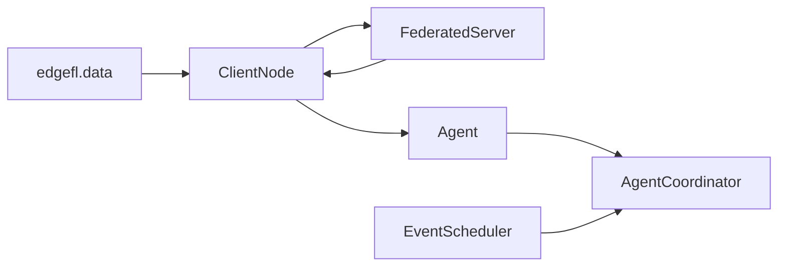

# EdgeFL Documentation

EdgeFL is a lightweight toolkit for experimenting with **federated learning (FL)** and **multi-agent coordination (MAS)** in edge environments.

## What you can do with EdgeFL

- Generate synthetic environmental datasets with realistic profile variation.
- Run federated training rounds with pluggable aggregation (`weighted`, `median`, `krum`).
- Wrap clients in agents and simulate churn, trust, and energy-aware participation.
- Track round-level metrics for validation quality, participation, fairness, and utility.

## Core architecture



## Minimal FL example

```python
from edgefl import ClientNode, FederatedServer, SklearnLinearModel, generate_clients_data

clients_data = generate_clients_data(n_clients=4, n_samples=180, seed=1)
X_val, y_val = clients_data[0]
clients = [
    ClientNode(client_id=i, X=X, y=y, model=SklearnLinearModel())
    for i, (X, y) in enumerate(clients_data)
]

server = FederatedServer(
    model=SklearnLinearModel(),
    clients=clients,
    validation_data=(X_val, y_val),
)

print(server.train_round()["validation"])
```

## Next steps

- Start with [Getting Started](getting_started.md).
- See package interactions in [Architecture](architecture.md).
- Explore practical patterns in [Use Cases](use_cases.md).
- Use runnable guides in [Examples](examples/index.md).
